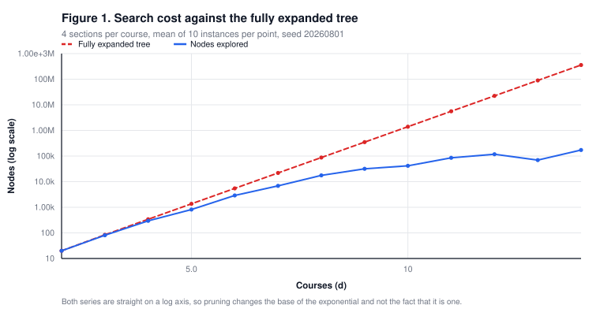
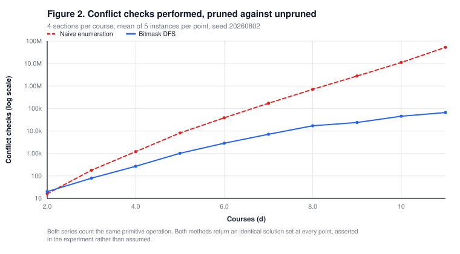
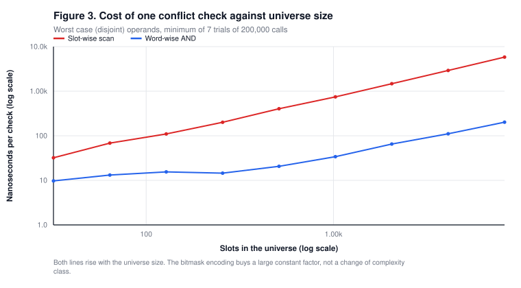
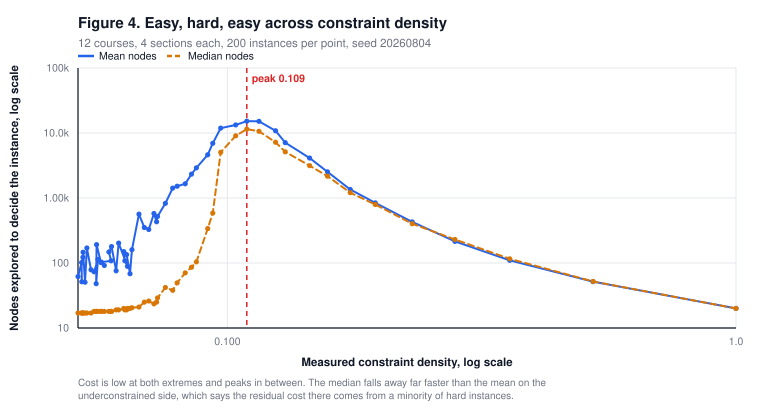
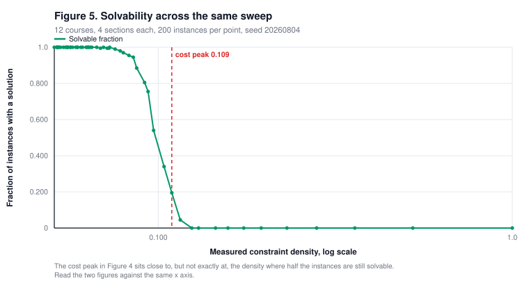

# 6. Evaluation

This section reports four experiments. The first two characterise the search,
the third tests the complexity claim about the conflict check, and the fourth
locates the hard region of the instance space.

## 6.0 Methodology

### Instance generation

Random instances are produced by
[`app/src/bench/instances.ts`](../app/src/bench/instances.ts) and emitted in the
same `Section[]` form the deployed engine consumes, with wall-clock meeting
times. Instances therefore exercise the real parsing, grouping and ordering
paths rather than a synthetic shortcut around them.

An instance is determined by five parameters and a seed.

| Parameter | Meaning | Value unless stated |
|---|---|---|
| $d$ | Courses | varies |
| $b$ | Sections per course | 4 |
| $\ell$ | Consecutive periods per meeting | 2 |
| Meetings | Meetings per week per section | 1 |
| Pool | Distinct placements a section may draw from | varies |

A *placement* is a pair of a weekday and a starting period. With five weekdays
and twelve periods, a two-period meeting admits
$5 \times 11 = 55$ placements in total. The generator shuffles all 55
deterministically, truncates to the pool size, and draws each section's meeting
uniformly from the truncated list. A small pool crowds sections into few
positions and makes conflicts near certain. A large pool spreads them and makes
conflicts rare. The pool is therefore a monotone control on constraint density.

The pool size is a knob, not a claim. Every experiment reports the **measured**
density of the instances it actually generated,

$$\rho \;=\; \frac{\#\{\text{conflicting cross-course section pairs}\}}
{\#\{\text{cross-course section pairs}\}} ,$$

computed by `measureDensity`. Pairs of sections belonging to the same course are
excluded, because the algorithm never places two sections of one course together
and such pairs constrain nothing.

### Randomness and reproducibility

All randomness comes from a seeded `mulberry32` generator in
[`app/src/bench/rng.ts`](../app/src/bench/rng.ts). `Math.random` is not used
anywhere in the experiment code. Every seed is recorded in the `config` block of
the corresponding JSON file under [`data/`](./data).

Results are split into two kinds in every output file.

- **`deterministic`** holds structural quantities such as nodes visited,
  conflict checks, solution counts, measured densities and solvable fractions.
  These are fully determined by the seeds and reproduce byte for byte on any
  machine. This was verified by running the suite twice and comparing.
- **`timing`** holds wall-clock and nanosecond measurements. These depend on
  hardware, on the state of the just-in-time compiler and on system load, and
  are **not** expected to reproduce exactly. No claim in this document rests on
  an exact timing value.

### Cutoffs

All four production cutoffs described in
[Section 4.4](./04-algorithm.md#the-cutoffs-break-completeness-by-design) are
disabled for every experiment, through the `UNBOUNDED` options in
[`app/src/bench/experiments.ts`](../app/src/bench/experiments.ts). A truncated
traversal would report a partial node count as though it were a complete one.
Experiment 1 additionally asserts that no run reached the result bound.

### Environment

Timing figures were produced on the following machine, recorded automatically in
[`data/environment.json`](./data/environment.json).

| Item | Value |
|---|---|
| CPU | 13th Gen Intel Core i9-13900H |
| Logical cores | 20 |
| Memory | 15.7 GB |
| Platform | Windows_NT 10.0.26200, x64 |
| Runtime | Node v22.15.1 |

The bench suite runs in a single fork with file parallelism disabled, so timing
measurements are not distorted by competing test processes.

### Reproducing

```bash
cd app && npm run bench
```

---

## Experiment 1

### Scaling in the number of courses

**Claim under test.** Exhaustive traversal cost grows exponentially in the
number of courses, while remaining far below the fully expanded tree.

**Design.** Sections per course is fixed at 4 and the pool at 18, giving a mean
measured density near $0.085$. The course count runs from 2 to 14. Ten instances
are generated at each point and the engine enumerates **all** conflict-free
selections. Seed $20260801$. Raw output in
[`data/experiment-1-scaling.json`](./data/experiment-1-scaling.json).

**On the bound.** The engine's node counter increments once per section
considered at every depth, so it counts partial assignments as well as complete
ones. The matching bound is the size of the fully expanded tree,
$\sum_{i \le d} \prod_{j \le i} b_{c_j}$, derived in
[Section 4.5](./04-algorithm.md#45-complexity-of-the-search). The product
$\prod_c b_c$ counts only the leaves and is reported separately. Comparing a
node count against the product would understate the bound and can yield a
fraction above one.

**Results.**

| $d$ | Fully expanded tree | Complete assignments | Mean nodes | Fraction visited | Mean solutions | Mean $\rho$ |
|---:|---:|---:|---:|---:|---:|---:|
| 2 | 20 | 16 | 20.0 | $1.00$ | 14.9 | 0.069 |
| 3 | 84 | 64 | 80.8 | $9.62 \times 10^{-1}$ | 50.0 | 0.077 |
| 4 | 340 | 256 | 295.6 | $8.69 \times 10^{-1}$ | 156.7 | 0.074 |
| 5 | 1 364 | 1 024 | 816.0 | $5.98 \times 10^{-1}$ | 328.3 | 0.103 |
| 6 | 5 460 | 4 096 | 2 895.2 | $5.30 \times 10^{-1}$ | 1 238.8 | 0.071 |
| 7 | 21 844 | 16 384 | 6 854.8 | $3.14 \times 10^{-1}$ | 2 290.1 | 0.079 |
| 8 | 87 380 | 65 536 | 17 593.2 | $2.01 \times 10^{-1}$ | 5 233.6 | 0.074 |
| 9 | 349 524 | 262 144 | 31 747.6 | $9.08 \times 10^{-2}$ | 5 980.2 | 0.084 |
| 10 | 1 398 100 | 1 048 576 | 41 526.0 | $2.97 \times 10^{-2}$ | 4 295.2 | 0.095 |
| 11 | 5 592 404 | 4 194 304 | 85 243.6 | $1.52 \times 10^{-2}$ | 10 093.2 | 0.087 |
| 12 | 22 369 620 | 16 777 216 | 117 501.2 | $5.25 \times 10^{-3}$ | 6 803.5 | 0.085 |
| 13 | 89 478 484 | 67 108 864 | 69 412.0 | $7.76 \times 10^{-4}$ | 1 185.3 | 0.091 |
| 14 | 357 913 940 | 268 435 456 | 171 894.8 | $4.80 \times 10^{-4}$ | 5 901.8 | 0.086 |



**Figure 1.** Nodes explored against the fully expanded tree, log vertical axis.
Seed $20260801$, ten instances per point.

**Reading.** Both series are close to straight on a log axis, which is the
signature of exponential growth in both. The fully expanded tree grows with base
exactly $b = 4$. The measured node count grows with an effective base of

$$\left( \frac{171\,894.8}{20} \right)^{1/12} \;\approx\; 2.13 ,$$

taken as the geometric mean of the successive ratios across the range. This is a
descriptive summary of the measured points and not a fitted model, and no
confidence interval is claimed for it.

The interpretation is that pruning changes the base of the exponential from
about 4 to about 2.13, and does not change the fact that it is exponential. That
is consistent with Theorem 3, which forbids any polynomial-time method unless
$\mathrm{P} = \mathrm{NP}$.

The fraction of the tree visited falls from $1.00$ at $d = 2$ to
$4.80 \times 10^{-4}$ at $d = 14$. At $d = 2$ nothing is pruned at all, because
at that density almost every assignment is a solution.

**Caveats.** Ten instances per point is a small sample and the series is
visibly noisy. The value at $d = 13$ is lower than at $d = 12$, which reflects
instance variation rather than any property of the algorithm. The mean solution
count varies non-monotonically across the range for the same reason. Conclusions
are drawn only from the overall trend across twelve doublings, not from
individual points.

---

## Experiment 2

### Pruning against uninformed enumeration

**Claim under test.** Bitmask depth-first search performs a small fraction of
the conflict checks that uninformed enumeration performs, and returns exactly
the same solution set.

**Design.** The baseline in [`app/src/bench/naive.ts`](../app/src/bench/naive.ts)
enumerates the full Cartesian product of section choices and tests each complete
assignment for pairwise conflicts, with no pruning. Course counts run from 2 to
11, five instances per point, pool 18, seed $20260802$. Raw output in
[`data/experiment-2-pruning.json`](./data/experiment-2-pruning.json).

**On unit fairness.** Node counts are not comparable across the two methods. The
baseline constructs complete assignments while the engine visits partial ones,
and comparing them directly is a category error that produced a negative
"reduction" in an earlier draft of this experiment.

The comparison used here is **conflict checks**, defined identically for both as
one conjunction of one day mask. The baseline was written to iterate only the
days a section actually meets, exactly as `fits` does in the engine, so that the
ratio measures pruning rather than an artefact of how the baseline was coded.
Node counts and assignment counts are reported alongside, in their own columns,
and are not compared to each other.

**Results.**

| $d$ | Complete assignments | Naive checks | DFS checks | Check reduction | DFS nodes | Mean solutions |
|---:|---:|---:|---:|---:|---:|---:|
| 2 | 16 | 16.0 | 20.0 | $-25.0\%$ | 20.0 | 15.2 |
| 3 | 64 | 179.2 | 79.2 | $55.8\%$ | 79.2 | 52.8 |
| 4 | 256 | 1 205.6 | 268.8 | $77.7\%$ | 268.8 | 145.0 |
| 5 | 1 024 | 8 147.0 | 1 018.4 | $87.5\%$ | 1 018.4 | 466.4 |
| 6 | 4 096 | 38 555.2 | 2 859.2 | $92.6\%$ | 2 859.2 | 1 156.6 |
| 7 | 16 384 | 171 259.0 | 7 139.2 | $95.8\%$ | 7 139.2 | 2 702.8 |
| 8 | 65 536 | 714 533.6 | 17 049.6 | $97.6\%$ | 17 049.6 | 5 144.2 |
| 9 | 262 144 | 2 790 584.0 | 23 872.8 | $99.1\%$ | 23 872.8 | 4 293.6 |
| 10 | 1 048 576 | 11 172 691.8 | 45 394.4 | $99.6\%$ | 45 394.4 | 9 269.2 |
| 11 | 4 194 304 | 52 899 833.6 | 66 311.2 | $99.9\%$ | 66 311.2 | 4 228.6 |



**Figure 2.** Conflict checks performed by each method, log vertical axis. Seed
$20260802$, five instances per point.

**Reading.** The reduction rises monotonically from $d = 3$ onward and reaches
$99.88\%$ at $d = 11$, where the baseline performs $52.9$ million day-mask
conjunctions against the engine's $66$ thousand. Wall-clock time follows the
same direction, by between two and three orders of magnitude on the reference
machine depending on the run. Exact durations live in the `timing` key of the
committed JSON and are deliberately not tabulated here, because they vary
between runs while the check counts do not.

**The negative value at $d = 2$ is real and is not an error.** The engine tests
every candidate at depth 0 against an empty mask, and those four tests per
instance can never fail. At $d = 2$ and this density there is almost nothing to
prune, so the overhead of testing exceeds the saving and the engine performs 20
checks where the baseline performs 16. Pruning becomes profitable from $d = 3$.
Any general claim that conflict-driven pruning always helps is therefore false,
and the previously documented figure of "80 to 95 percent" is not a constant of
the algorithm but a function of size and density.

**Correctness cross-check.** At every point the experiment asserts that the two
methods return identical solution sets, compared as sorted canonical keys. All
ten points pass. This is an independent check on Theorem 4 and Theorem 5 over
these instances, since the baseline shares no code with the engine beyond the
mask construction.

**Caveats.** The comparison is against uninformed enumeration, which is the
weakest possible baseline. It establishes that pruning helps, and says nothing
about how the engine compares to a constraint solver with propagation, ordering
heuristics or clause learning. No such comparison is made in this document.

---

## Experiment 3

### Cost of the conflict check as the slot universe grows

**Claim under test.** The word-wise check costs a large constant factor less
than the slot-wise check, but both grow linearly in the size of the slot
universe. Constant time holds only for a fixed universe.

**Design.** Two implementations of the same predicate are compared in
[`app/src/bench/maskVariants.ts`](../app/src/bench/maskVariants.ts). One
conjoins `Uint32Array` words, the other scans a `Uint8Array` slot by slot. The
universe grows from 32 to 8192 slots. Each measurement is the minimum of 7
trials of 200 000 calls, after a warm-up pass. Raw output in
[`data/experiment-3-microbench.json`](./data/experiment-3-microbench.json).

The operands are constructed **disjoint**. Both implementations return on the
first overlap, so a conflicting pair would exit after a couple of iterations and
measure nothing. The disjoint case forces the full scan and is the worst case,
which is what a complexity claim concerns. The minimum across trials is reported
rather than the mean, because every source of noise on a multitasking operating
system adds time rather than removing it.

**Results.**

| Slots $|T|$ | Words | Word-wise ns | Slot-wise ns | Speedup | ns per word | ns per slot |
|---:|---:|---:|---:|---:|---:|---:|
| 32 | 1 | 7.62 | 34.8 | $4.6\times$ | 7.62 | 1.09 |
| 64 | 2 | 11.61 | 61.4 | $5.3\times$ | 5.81 | 0.96 |
| 128 | 4 | 13.28 | 109.3 | $8.2\times$ | 3.32 | 0.85 |
| 256 | 8 | 17.27 | 192.8 | $11.2\times$ | 2.16 | 0.75 |
| 512 | 16 | 17.09 | 376.4 | $22.0\times$ | 1.07 | 0.74 |
| 1 024 | 32 | 28.53 | 735.7 | $25.8\times$ | 0.89 | 0.72 |
| 2 048 | 64 | 69.56 | 1 456.9 | $20.9\times$ | 1.09 | 0.71 |
| 4 096 | 128 | 117.58 | 2 985.3 | $25.4\times$ | 0.92 | 0.73 |
| 8 192 | 256 | 205.29 | 5 896.8 | $28.7\times$ | 0.80 | 0.72 |



**Figure 3.** Nanoseconds per conflict check against universe size, both axes
logarithmic.

**Reading.** The two rightmost columns are the decisive ones. The slot-wise cost
per slot converges to about $0.72$ ns and the word-wise cost per word converges
to about $0.80$ ns. Both implementations therefore settle into a constant cost
per unit of work, and both perform work linear in $|T|$, differing only in the
size of the unit. The measured speedup rises toward

$$\frac{0.72 \times 32}{0.80} \;\approx\; 29 ,$$

which matches the observed $28.7\times$ at 8192 slots and sits just below the
word size $w = 32$, as it must.

At small universes the speedup is far below $w$ because a fixed per-call
overhead of roughly 8 ns dominates a single-word conjunction. This is a property
of the measurement harness and of the runtime, not of the algorithm.

**Conclusion.** The check is $\Theta(|T|/w)$, not $O(1)$. The bitmask encoding
buys a constant factor approaching the word size and does not change the
complexity class, exactly as Proposition 4 of
[Section 3.4](./03-complexity.md#34-what-the-bitmask-encoding-does-not-change)
requires. The deployed configuration is the special case in which $|T|$ is fixed
at 84 and the check is genuinely constant, measured here at $12.92$ ns for the
seven-day form.

**Caveats.** These are JavaScript measurements under a just-in-time compiler.
Absolute nanosecond values would differ in a compiled language and would likely
show a larger speedup, since the word-wise loop vectorises readily. The
asymptotic shape, which is what the claim concerns, would not change.

---

## Experiment 4

### Constraint density phase transition

**Claim under test.** Mean search cost for the decision problem is low at both
extremes of constraint density and peaks in between, near the density at which
instances stop being solvable. This is the easy-hard-easy pattern described by
Cheeseman, Kanefsky and Taylor [5].

**Design.** Twelve courses, four sections each, with the placement pool swept
over every integer from 1 to 55. Two hundred instances are generated at each of
the 55 points, for 11 000 instances in total. Seed $20260804$. Raw output in
[`data/experiment-4-phase-transition.json`](./data/experiment-4-phase-transition.json).

The engine is asked for **one** solution, not all of them. The object of study
is the decision problem of
[Section 2.1](./02-problem-formulation.md#21-the-decision-problem). Under that
framing an underconstrained instance is easy because a solution is reached
almost immediately, and an overconstrained instance is easy because
unsatisfiability is proved close to the root. The cost peaks between the two
regimes. An experiment that enumerated all solutions would instead measure the
size of the solution set, which grows without bound as constraints are removed,
and would hide the effect completely.

**Results.** A representative subset of the 55 points.

| Pool | Measured $\rho$ | Mean nodes | Median nodes | Solvable fraction |
|---:|---:|---:|---:|---:|
| 1 | 1.000 | 20.0 | 20 | 0.000 |
| 2 | 0.523 | 51.6 | 52 | 0.000 |
| 4 | 0.280 | 215.0 | 230 | 0.000 |
| 6 | 0.195 | 840.7 | 794 | 0.000 |
| 8 | 0.157 | 2 524.9 | 2 166 | 0.000 |
| 10 | 0.130 | 7 104.6 | 5 132 | 0.000 |
| 11 | 0.124 | 10 817.9 | 7 208 | 0.000 |
| 12 | 0.115 | 15 128.4 | 10 616 | 0.045 |
| **13** | **0.109** | **15 222.4** | **11 474** | **0.195** |
| 14 | 0.104 | 13 311.3 | 9 054 | 0.340 |
| 15 | 0.097 | 11 884.6 | 5 047 | 0.540 |
| 16 | 0.094 | 6 938.8 | 585 | 0.755 |
| 18 | 0.087 | 2 909.7 | 104 | 0.885 |
| 20 | 0.083 | 1 655.5 | 70.5 | 0.955 |
| 24 | 0.073 | 520.6 | 29 | 1.000 |
| 32 | 0.063 | 134.6 | 19 | 1.000 |
| 40 | 0.059 | 108.2 | 18 | 1.000 |
| 55 | 0.052 | 51.5 | 17 | 1.000 |



**Figure 4.** Nodes explored to decide an instance, against measured constraint
density. Both axes logarithmic. Density is plotted logarithmically because it
spans 0.052 to 1.000, and on a linear axis the entire transition would be
compressed into the leftmost tenth of the plot. Seed $20260804$, 200 instances
per point.



**Figure 5.** Fraction of instances admitting a solution, over the same sweep
and the same horizontal axis.

**Reading.** The pattern is present and pronounced.

- At $\rho = 1.000$ every pair of sections conflicts. The engine rejects every
  candidate at the first two levels and decides the instance in 20 nodes.
- At $\rho = 0.052$ conflicts are rare, a solution is found almost immediately,
  and the mean cost is 51.5 nodes with a median of 17.
- Between them the mean cost rises to $15\,222$ nodes at $\rho = 0.109$. That is
  $761$ times the cost at the overconstrained extreme and $296$ times the cost
  at the underconstrained extreme.

The **cost peak** sits at $\rho = 0.109$, where $19.5\%$ of instances are
solvable. The **solvability crossover**, the sampled point at which the solvable
fraction is closest to one half, sits at $\rho = 0.097$ with a solvable fraction
of $0.540$. The two are close but not identical, and the peak lies on the
overconstrained side of the crossover. Peak and crossover are commonly reported
as coinciding asymptotically, and the offset seen here at $d = 12$ is consistent
with a finite-size effect. This document does not test that explanation, and the
offset is reported as measured.

The median tells a sharper story than the mean on the underconstrained side. At
pool 16 the mean is $6\,939$ while the median is $585$, and by pool 18 the
median has fallen to 104 while the mean is still $2\,910$. Most instances just
past the transition are solved almost immediately, and the mean is held up by a
small minority of hard ones. Reporting only the mean would misdescribe the
typical case.

**Relation to the deployed system.** A realistic student timetable sits far to
the right of the transition, with a handful of courses and sparse conflicts,
which is the region where the median cost is a few dozen nodes. The deployed
engine is fast in practice because its instances are easy, not because the
problem is easy. That distinction is the practical content of Experiment 4.

**Caveats.** The generator produces one particular family of random instances,
with a single two-period meeting per section drawn uniformly from a shuffled
placement pool. Real timetables are structured, with recurring patterns and
correlated meeting times, and there is no claim here that they are distributed
like these. The location of the transition is a property of this family at
$d = 12$ and $b = 4$, and it would move under other parameters. What is claimed
is the presence and shape of the easy-hard-easy pattern, which is a robust
phenomenon across many problem families [5].

> Run this live. The **Phase Transition Runner** on the application's Docs page
> regenerates this sweep in the browser with adjustable density and seed. It
> calls the same `runPhaseTransition` function that produced Figures 4 and 5, so
> a run at seed $20260804$ with 200 instances per point reproduces the published
> curve exactly.

---

## 6.5 Summary

| Experiment | Claim | Verdict |
|---|---|---|
| 1 | Traversal is exponential in $d$ | Supported. Effective base about 2.13 against an unpruned base of 4 |
| 2 | Pruning removes most of the work | Supported for $d \ge 3$, reaching $99.88\%$ at $d = 11$. Contradicted at $d = 2$, where it is a net cost |
| 3 | The conflict check is $O(1)$ | Contradicted as an unqualified claim. Measured as $\Theta(\lvert T \rvert / w)$, constant only for fixed $\lvert T \rvert$ |
| 4 | Cost peaks at a critical density | Supported. Peak at $\rho = 0.109$, $761\times$ the overconstrained extreme and $296\times$ the underconstrained one |
